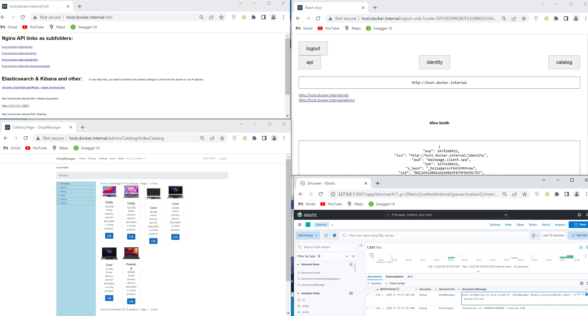

# SSO AspNetCore React Docker application

this is a sample development environment for microservice application

## Used technologies/tools:
- KeyCloak  (IdentityServer4 was changed by quay.io/keycloak/keycloak:latest)
- C# 10.0 with ASP.NET CORE 7.0 
- create-react-app with typescript
- Nginx proxy
- GitLab CI/CD
- PostgreSQL DB
- ELK (Elasticsearch, Logstash, Kibana)
- Kubernates (k3s) production GitLab CI/CD deployment 
- Powershell

## Start project localy
for Windows
Prerequisites:
- install [openssl](https://thesecmaster.com/procedure-to-install-openssl-on-the-windows-platform/)
  used version: OpenSSL 3.0.7 1 Nov 2022 (Library: OpenSSL 3.0.7 1 Nov 2022)
```

./start.ps1

or

cd src
docker-compose -f docker-compose.misc.yml up -d
docker-compose --env-file ./.env.win up
docker-compose -f docker-compose.elk.yml up -d
```

For Linux from local gitlab
```
sudo rm -rf nevashop
git clone --branch dev git@gitlab.neva.loc:shop/nevashop.git

#Create self signet sertificate
cd ~/nevashop/src/srv/buildcertificate/
sudo chmod +x buildcrt.sh 
sudo ./buildcrt.sh host.docker.internal 
mkdir -p ./rootca
sudo cp -R host.docker.internal.* ./rootca
ls /rootca
sudo cp -R host.docker.internal.* /usr/local/share/ca-certificates/
sudo update-ca-certificates -f


docker-compose -f docker-compose.misc.yml up -d --force-recreate
docker-compose --env-file ./.env.linux -f docker-compose.yml -f docker-compose.override.yml up --force-recreate
docker-compose -f docker-compose.elk.yml up -d --force-recreate


```
## Project URL
https://host.docker.internal - WebSPA

https://host.docker.internal/ref - html misc references: ELK, Mailhog, Admin

https://host.docker.internal/admin - Web MVC

https://host.docker.internal/catalog/swagger - CatalogAPI swagger

<p align="center">
  
</p>

## GitLab CI/CD compose files in folder ./deployment/gitLabci/
Build machine: https://ubuntu22.neva.loc

GitLab Docker Runner setup
```
  [runners.docker]
  ...
    volumes = ["/var/run/docker.sock:/var/run/docker.sock", "/cache", "/srv/rootca:/rootca:ro", /srv:/srv"]
```

## reset chrome cache
```
chrome://net-internals/#hsts

chrome:restart
```

Check Self signet certificate for domain
```
cd deployment/TestSSL
docker-compose --env-file ./.env_linux -f docker-compose.sslnginx.yml up
```

## Build frontend only
```
docker-compose --env-file ./.env.win build --force-rm --no-cache --progress plain frontend
```

## Full mode start batch

Run ELK stack, import 2 kibana index patern and generate strong certificate from Root CA
```
./start.ps1 -Mode up -ELKenable $true -IsSimpleCertificate $false

#Enter PEM pass phrase: enter password (qweasdzxc)
#Verifying - Enter PEM pass phrase: enter password
#Enter pass phrase for rootca/rootCA.key: enter password
#Enter pass phrase for rootca/rootCA.key: enter password
#Enter Export Password: empty password
#Verifying - Enter Export Password: empty password

```